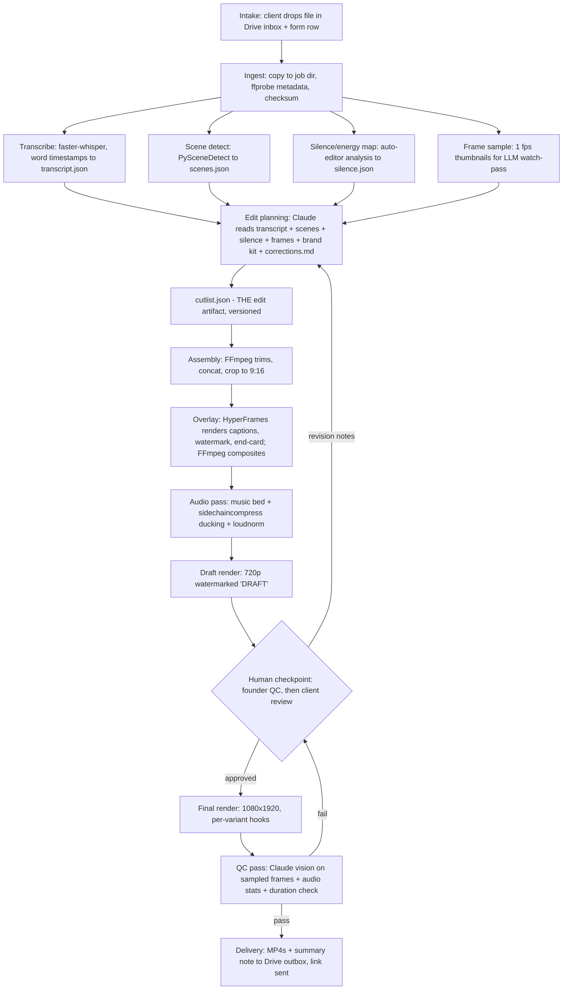

# MVP Plan: Agentic Brand-Locked Short-Form Video Editor

> ⚠️ **Partially superseded by `07-product-spec.md`.** This doc framed the MVP as an agency workflow (Drive folders, client onboarding, paid APIs, Claude Code as the operator interface). The v0 build is now a local, SaaS-shaped product: raw footage in → edited footage out, over an HTTP API, on a free/cheap stack. See `07-product-spec.md` §11 for the six specific changes.
>
> Still canonical here: the editing doctrine (§4 house style), the cutlist concept (§3), the use cases (§2), and the edge-case catalogue (§6).

**Date:** July 2026
**Reads on:** `01-market-research.md` (the wedge: raw talking-head/creator footage in → finished brand-locked short-form ad/video out, sold to DTC brands and performance agencies) and `02-technical-feasibility.md` (the stack: Claude Code as director, JSON cutlist, auto-editor + FFmpeg, faster-whisper, PySceneDetect, HyperFrames, optional Seedance b-roll via fal, ElevenLabs audio).

**Framing:** This is not a SaaS platform. It is a scrappy internal tool that lets one person run a "video editing agency" where the editor is Claude Code. Every design decision below optimizes for: fewest moving parts, fewest accounts to create, fastest path to *one real raw video in → one client-ready branded short out* with at most one human touchpoint.

---

## 1. MVP Scope

### The one video type

**Single-speaker talking-head footage → branded 9:16 vertical short (15–90 seconds), delivered as MP4.**

That's it. One speaker on camera (founder rant, UGC testimonial, expert explainer), edited down to a tight short with: silence/dead-air removed, a hook up front, brand-styled animated captions, logo watermark, branded end-card with CTA, licensed-safe background music ducked under the voice, loudness-normalized for social platforms.

### In scope (v1)

- Input: one raw video file per job, 1–15 minutes, from a phone or webcam, horizontal or vertical, one primary speaker.
- Transcription with word-level timestamps (faster-whisper, local, $0).
- Silence / filler / dead-space removal (auto-editor).
- LLM edit planning: Claude reads the transcript + scene log + sampled frames, picks the hook, selects and orders segments, writes the JSON cutlist.
- 9:16 output. Horizontal sources get a center-weighted crop with a manually-verifiable face check (see edge cases) — not a fancy tracking crop in v1.
- Brand kit per client: colors, fonts, logo, caption style, banned words, CTA text, music vibe — plain files in a folder.
- Captions: word-timed, brand-styled, rendered via HyperFrames (HTML/CSS overlay), composited by FFmpeg.
- Branded end-card (logo + CTA, 2–3 seconds) rendered via HyperFrames.
- Audio: background music (ElevenLabs Music or a small pre-cleared local library), FFmpeg `sidechaincompress` ducking, `loudnorm` to platform targets (-14 LUFS).
- Hook variants: generate up to 3 versions of the same short that differ only in the opening 3–5 seconds (different hook segment or different caption hook line).
- Draft → human review → final render loop (one checkpoint).
- QC pass: Claude reviews sampled frames of the render + the audio waveform stats before anything is marked deliverable.
- Delivery: MP4 + a one-paragraph "what I did" note, shared via a cloud-drive link.
- Optional, behind a flag: 1–2 Seedance b-roll inserts via fal for jobs that explicitly request it. Off by default — it adds cost, latency, and a failure mode.

### Out of scope (v1) — be ruthless

- **No web app, no dashboard, no accounts, no queue UI.** (Justified below.)
- No multicam, no multi-speaker podcast editing, no long-form output.
- No AI avatars / synthetic actors (HeyGen etc.) — the market doc's whole thesis is "real footage, AI-edited" as the trust safe harbor.
- No motion graphics beyond captions/lower-third/end-card (market doc: motion graphics is the wrong MVP).
- No auto-reframe with subject tracking (AutoFlip/YOLO) — center crop + human eyeball in v1; tracking reframe is a fast-follow.
- No Remotion (license cost + minimum spend; HyperFrames is free and agent-native).
- No OTIO export, no "open in Premiere."
- No self-serve anything. Clients talk to a human (the founder) over email/Slack/WhatsApp.
- No learning brand model yet — but every revision note gets *logged per client* so the moat data starts accumulating from day one (a `corrections.md` per brand; the agent reads it before every edit).
- No payments integration. Invoice manually.

### Why no web app — decision and justification

**Decision: no web app in v1. Intake via a shared cloud-drive folder + a short intake form; delivery via a share link.**

Justification:

1. The customer at this stage is 3–10 design partners, all hand-held. A Dropbox/Google Drive folder per client (`/clients/<brand>/inbox/`) is a perfectly good upload UI, handles 4 GB phone videos better than any homemade uploader, gives resumable uploads for free, and requires zero code.
2. The whole product thesis (tech doc §8) is that the value is in the prompts/skills/cutlist, not the plumbing. A web app is plumbing that delays contact with the real problem (edit quality).
3. Human-in-the-loop review works fine over a link: render draft → drop in `/outbox/drafts/` → send the link → client replies with notes in plain English → notes are pasted verbatim into the revision command. Clients already work this way with human editors.
4. A Google Form (brand name, footage link, desired length, CTA, "anything special?") gives structured intake in 10 minutes of setup. The form's spreadsheet row is the job ticket.

The trigger to build a UI later: >2 concurrent clients causing folder chaos, or clients asking for self-serve status. Not before.

---

## 2. Use Cases (the concrete jobs)

1. **Founder rant → branded short.** A DTC founder records a 5-minute unscripted phone video about why they built the product. Output: one 45–60s vertical short with a hook pulled from the strongest 3 seconds, silences and rambles cut, brand-styled captions, logo watermark, end-card with "Shop now → brand.com", music bed. Turnaround target: same day.

2. **1 UGC testimonial → 3 hook variants.** An agency sends one raw Billo/Insense creator testimonial (60–120s raw). Output: three ~30s ad variants sharing the same body but opening with three different hooks (problem-first, result-first, question-first), each brand-locked, named `brand_testimonial_hookA/B/C.mp4` — ready to A/B on Meta/TikTok. This is the money use case: it directly serves the 15–25-variant creative-volume demand.

3. **Expert explainer → weekly short.** A B2B founder records a 3-minute "one idea" talking-head weekly. Output: one 60–90s short, consistent look week over week (this is where the per-client corrections log starts compounding).

4. **Long take → best-60-seconds.** Client sends 10–15 minutes of loose takes ("I said it three ways, pick the best"). The agent picks the best take per beat using transcript + repetition detection, assembles the tightest version. This exercises the LLM watch-pass hardest and is the clearest "a clip tool cannot do this" demo.

5. **Re-skin an existing short for a second placement.** Same cutlist, re-render with a different end-card CTA or caption language ("Shop now" → "Link in bio"). Nearly free (re-run overlay + assembly only), sells as a variant.

All five are the same pipeline with different parameters — that's the test for whether scope is really narrow enough.

---

## 3. System Design & Architecture

### Pipeline



Every stage writes its artifact to disk in the job folder. Any stage can be re-run in isolation. The pipeline is a set of small CLI scripts; Claude Code is the thing that decides to call them and in what order — but each one also runs standalone for debugging.

### Brand kit format

One folder per client, checked into the repo (or a private submodule). Plain files, because plain files are what the agent reads natively.

```
clients/acme/
├── brand.yaml          # the machine-readable kit
├── logo.png            # transparent PNG, plus logo_light.png if needed
├── fonts/
│   └── AcmeSans-Bold.ttf   # licensed for this use — see edge cases
├── music/              # optional pre-cleared tracks; else generated
├── endcard.html        # optional custom end-card template (HyperFrames)
└── corrections.md      # append-only log of every revision note, ever
```

`brand.yaml`:

```yaml
brand: Acme Skincare
colors:
  primary: "#1A6B54"
  accent: "#F4C95D"
  caption_text: "#FFFFFF"
  caption_highlight: "#F4C95D"   # active-word color
fonts:
  captions: AcmeSans-Bold        # must exist in fonts/
  fallback: Montserrat-Bold      # bundled, known-licensed
captions:
  style: word-pop                # word-pop | karaoke | blocks
  position: lower-third          # keep out of platform UI safe zones
  max_words_per_line: 4
  uppercase: true
logo:
  watermark: true
  watermark_position: top-right
  watermark_opacity: 0.85
endcard:
  duration_s: 2.5
  cta_text: "Shop now → acme.com"
music:
  vibe: "warm, upbeat, acoustic, no vocals"
  energy: medium
voice:
  banned_words: ["cheap", "guys"]
  profanity_policy: bleep        # bleep | cut | allow | flag
  tone_notes: "confident but friendly; never salesy-shouty"
platform_targets: [tiktok, reels]
```

### Cutlist JSON schema (the edit artifact)

The cutlist is the product's one novel artifact: authored by Claude, executed by scripts, diffable, human-inspectable, re-renderable. Actual example:

```json
{
  "version": 1,
  "job_id": "acme-2026-07-19-001",
  "source": "raw/founder_rant.mp4",
  "brand": "acme",
  "output": {
    "aspect": "9:16",
    "resolution": [1080, 1920],
    "target_duration_s": 60,
    "crop": { "mode": "center", "x_offset_pct": 0 }
  },
  "segments": [
    {
      "id": "hook",
      "in_s": 143.20,
      "out_s": 147.85,
      "role": "hook",
      "note": "strongest line: 'we lost $40k learning this'",
      "speed": 1.0,
      "transition_out": "cut"
    },
    {
      "id": "body-1",
      "in_s": 12.40,
      "out_s": 31.10,
      "role": "body",
      "transition_out": "cut"
    },
    {
      "id": "body-2",
      "in_s": 55.00,
      "out_s": 78.60,
      "role": "body",
      "transition_out": "cut"
    },
    {
      "id": "cta",
      "in_s": 231.00,
      "out_s": 238.20,
      "role": "cta",
      "transition_out": "fade"
    }
  ],
  "overlays": [
    { "type": "captions", "style": "brand", "source": "transcript.json", "burn": true },
    { "type": "watermark", "asset": "clients/acme/logo.png", "position": "top-right", "from_s": 0, "to_s": "end" },
    { "type": "endcard", "template": "default", "duration_s": 2.5 }
  ],
  "audio": [
    { "type": "music", "source": "generated", "prompt": "warm upbeat acoustic no vocals", "gain_db": -18, "duck": true },
    { "type": "loudnorm", "target_lufs": -14 }
  ],
  "variants": [
    { "id": "hookA", "replace_segment": "hook", "in_s": 143.20, "out_s": 147.85 },
    { "id": "hookB", "replace_segment": "hook", "in_s": 8.10, "out_s": 12.05 },
    { "id": "hookC", "replace_segment": "hook", "in_s": 190.30, "out_s": 194.90 }
  ],
  "qc_notes": "watch seg body-2 tail — speaker looks off-camera at 78.2s"
}
```

Rules baked into the schema validator (a small Python script): segments must not overlap, `in_s < out_s`, total duration within ±15% of target, every timestamp within source bounds, cut points must land on word boundaries (±80 ms) per the transcript so cuts never clip a word.

### Repo / folder structure

```
editor/
├── CLAUDE.md                  # editing taste, house style, pipeline rules
├── docs/                      # 01, 02, this file
├── .claude/
│   └── skills/
│       ├── edit-plan/         # skill: transcript+scenes+frames -> cutlist
│       ├── revise/            # skill: client notes -> cutlist diff
│       └── qc/                # skill: frame/audio review -> pass/fail + notes
├── scripts/
│   ├── ingest.py              # copy in, ffprobe, checksum, job dir scaffold
│   ├── transcribe.py          # faster-whisper -> transcript.json
│   ├── analyze.py             # PySceneDetect + auto-editor analysis + frame sampling
│   ├── validate_cutlist.py    # schema + sanity rules
│   ├── assemble.py            # cutlist -> FFmpeg trim/concat/crop -> base.mp4
│   ├── overlay.py             # HyperFrames captions/watermark/endcard -> composited.mp4
│   ├── audio.py               # music + ducking + loudnorm
│   ├── render.py              # draft (720p watermarked) or final (1080x1920) per variant
│   └── qc_extract.py          # sample frames + audio stats for the QC skill
├── clients/
│   └── acme/                  # brand kit per client (structure above)
├── jobs/                      # gitignored; one dir per job
│   └── acme-2026-07-19-001/
│       ├── raw/  ├── analysis/  ├── cutlist.json  ├── renders/  └── notes.md
└── assets/
    ├── fonts/                 # known-licensed fallback fonts
    └── music/                 # small pre-cleared fallback library
```

---

## 4. The Agent Loop — how Claude Code actually runs this

**Principle: prompts + scripts, not a platform.** Claude Code is the director sitting in this repo. The deterministic work lives in `scripts/` (each independently runnable); the judgment lives in `CLAUDE.md` and three skills. The founder types one command per job and one per revision.

### CLAUDE.md encodes the editing taste

The house style lives in `CLAUDE.md` and is the actual moat-in-progress. Contents:

- **Pacing rules:** first cut within 2s; no shot of the same framing longer than ~7s without a caption emphasis or punch-in (2–8% digital zoom via FFmpeg crop — free "b-roll"); kill every silence >0.4s but *never* two cuts within 0.7s of each other (machine-gun cutting reads as glitchy).
- **Hook doctrine:** the hook is the single strongest claim/emotion/number in the transcript, not necessarily the chronological opening; if no sentence works standalone, front-load a caption card with the best line while early footage plays underneath; flag "no usable hook" rather than shipping a weak one.
- **Structure grammar** (from the market doc): hook → problem/story → proof/demo → CTA. Cut anything that doesn't serve a beat.
- **Caption rules:** never cover the speaker's mouth; stay inside platform safe zones; sentence-level chunks of ≤4 words; emphasize numbers and product names in the brand accent color.
- **Brand rules:** always read `clients/<brand>/brand.yaml` AND `corrections.md` before planning; corrections override defaults; when a correction conflicts with house style, the correction wins and gets noted.
- **Honesty rules:** never fabricate words (captions come only from the transcript); never reorder segments so as to change the speaker's meaning; when unsure, flag in `qc_notes` instead of guessing.

### One command per stage

The founder's whole interface is Claude Code in the terminal:

- `"New job for acme: <drive-link>, 60s, 3 hook variants"` → the agent runs ingest → transcribe → analyze, then invokes the **edit-plan skill**: reads transcript.json, scenes.json, silence.json, sampled frames, brand.yaml, corrections.md; writes cutlist.json; runs the validator; then assembly → overlay → audio → **draft render** (720p, "DRAFT" burned in). It stops and prints: draft path, duration, chosen hook line, any qc_notes, cost so far.
- **Checkpoint (the one human touchpoint):** founder watches the 60-second draft (~2 minutes of human time), then either forwards the link to the client or types notes.
- `"Revise: client says hook feels slow and captions cover her face at 0:22"` → **revise skill**: maps each note to a cutlist change (swap hook to variant B candidate; shift caption block position for that time range), writes cutlist.json v2 with a one-line diff summary, appends the note verbatim to `clients/acme/corrections.md`, re-renders draft.
- `"Approved — finals"` → final render at 1080×1920 for the main cut plus each hook variant, then the **qc skill**: extract 12 evenly-sampled frames + first/last frames + audio stats (LUFS, peak, silence at head/tail); Claude vision checks: captions inside safe zones, logo present and not clipped, face not cut by the crop, no black/frozen frames, end-card renders, duration in spec. Pass → files copied to Drive outbox with a summary note, link printed. Fail → specific fix + back to checkpoint.

### Why this stays simple

No daemon, no queue, no webhooks. State is the filesystem. If anything crashes, the artifacts on disk mean any stage re-runs idempotently (`render.py` checks for existing outputs). The Claude Agent SDK headless version of this loop is the v2 automation story; v1 is a human typing three sentences per job.

---

## 5. User Stories

**S1 — Onboard a brand kit.** *As a DTC marketer, I want to hand over my brand assets once so every video comes back on-brand without me re-explaining.*
Acceptance: I send logo, fonts, hex colors, CTA, and preferences via the intake form/email; within 1 business day a test clip rendered with my kit comes back for sign-off; after sign-off, no video ever ships with wrong colors/fonts/logo.

**S2 — Onboard with an incomplete kit.** *As a marketer without a formal brand guide, I want sensible defaults so I can start anyway.*
Acceptance: given just a logo and a website URL, the operator proposes a kit (colors sampled from the logo/site, licensed fallback font); I approve or tweak it before the first real job; the proposed kit is stored like any other.

**S3 — Submit footage.** *As a founder, I want to drop a raw phone video in a shared folder and say what I want in one form, so submitting takes under 5 minutes.*
Acceptance: upload to my Drive inbox folder + a form with target length, CTA, and free-text notes; I get an acknowledgment with an ETA within a few hours (manual is fine); unsupported/corrupt files are flagged to me the same day, not silently dropped.

**S4 — Receive a draft.** *As a marketer, I want a watermarked draft within 24 hours so I can react before anything is final.*
Acceptance: draft link arrives ≤24h (target: same day); draft is watermarked "DRAFT", correct aspect and target length ±15%; comes with a 3-sentence note (chosen hook, what was cut, anything flagged).

**S5 — Request a revision.** *As a marketer, I want to give notes in plain English — not timestamps and jargon — and get a corrected draft fast.*
Acceptance: I reply to the draft link in plain English; revised draft ≤24h (target: same session); the reply states what changed; my notes are remembered — the same mistake doesn't recur on my next video (corrections.md).

**S6 — Approve and receive finals.** *As a marketer, I want clean final files ready to upload to TikTok/Meta with zero further processing.*
Acceptance: on "approved," finals arrive ≤4h: 1080×1920 MP4, H.264 + AAC, -14 LUFS, no draft watermark, sensible filenames (`acme_founderstory_hookA_60s.mp4`); files pass TikTok/Meta upload validation as-is.

**S7 — Receive hook variants.** *As a performance marketer, I want 3 hook variants of one ad so I can A/B without paying for 3 edits.*
Acceptance: variants differ only in the opening 3–5s; each is separately named and delivered; the note says which hook is which in one line each; variant cost to me is a fraction of a full edit.

**S8 — Re-skin a delivered video.** *As an agency, I want the same edit re-rendered with a different CTA/end-card for another placement.*
Acceptance: I name the delivered video and the change; the re-skin arrives ≤4h; nothing else about the edit shifts (same cutlist, new overlay).

**S9 — Get flagged early on unusable footage.** *As a founder, I don't want to wait a day to learn my footage was unusable.*
Acceptance: if audio is inaudible, the file is corrupt, or there's no usable hook, I'm told within hours of submission with a specific, human-readable reason and what to re-shoot — before any edit work is "delivered."

**S10 — Weekly recurring shorts.** *As a B2B founder, I want my weekly video to come back in a consistent style that improves with feedback.*
Acceptance: submitting works identically each week; style stays consistent (same kit + growing corrections log); by video 4, my revision count is measurably lower than video 1 (tracked in the metrics sheet).

**S11 — Operator runs a job end-to-end.** *As the operator (founder of this tool), I want one command to take a job from raw file to reviewable draft so a job costs me minutes, not hours.*
Acceptance: one command produces draft + summary with no manual intermediate steps in the happy path; total hands-on time per happy-path job ≤10 minutes; any stage failure tells me which stage and re-runs idempotently.

**S12 — Operator audits any edit.** *As the operator, I want every edit inspectable and reproducible so client questions never require archaeology.*
Acceptance: every delivered video has its job dir with cutlist versions, transcript, and render log; re-running the cutlist reproduces the video bit-for-bit-equivalent; cutlist diffs show what each revision changed.

---

## 6. Edge Cases Not to Miss

| # | Edge case | Detection | v1 handling |
|---|---|---|---|
| 1 | **Bad/noisy/quiet audio** | ffprobe + loudness stats at ingest; Whisper avg word confidence below threshold | FFmpeg `afftdn` denoise + gain as a first attempt; if confidence still low → **stop and flag to client** with "please re-record; here's how" before wasting an edit |
| 2 | **Multiple speakers** | Whisper/pyannote-lite speaker count heuristic; LLM notices dialogue in transcript | Out of scope: politely decline / flag for human. If one speaker dominates >85% of words, proceed and note it |
| 3 | **Horizontal source → 9:16** | ffprobe aspect at ingest | Center crop by default; QC skill checks sampled frames for face position; if face sits off-center, a single static `x_offset_pct` in the cutlist fixes it (human sets it at checkpoint). No tracking in v1 |
| 4 | **Footage too short** (< ~90s raw for a 60s target) | Duration vs. target at ingest | Auto-lower the target ("best 25s") and say so in the draft note; if <20s usable, flag to client |
| 5 | **Footage too long** (>15 min) | Duration at ingest | Accept up to 15 min; beyond that, ask the client which portion to use (a 40-min file is a different product) |
| 6 | **Profanity** | Transcript scan against wordlist + brand banned_words | Per-brand `profanity_policy`: bleep (default; SFX + caption `#@%!`), cut, allow, or flag. Banned brand words always cut or flagged |
| 7 | **Silence-removal destroys pacing** | Rule in validator: no two cuts <0.7s apart; breath-gap floor (keep ≥150 ms gaps at sentence ends) | auto-editor margins set conservatively (`--margin 0.2s`); Claude reviews the silence map rather than blindly applying it; human catches the rest at draft checkpoint |
| 8 | **Caption timing drift** | Spot-check in QC: 3 random caption timestamps vs. word timestamps must align ±100 ms after concat re-timing | Captions are re-timed *from the cutlist math* (source time → output time mapping), never from re-transcribing the render. The mapping function gets a unit test in week 1 |
| 9 | **Brand font licensing** | Onboarding checklist question: "is this font licensed for video/social use by you?" | Client attests in writing (form checkbox); if unsure → bundled fallback font (open-licensed). Never scrape fonts from a website |
| 10 | **Huge files** (>4 GB, 4K/60) | ffprobe at ingest | Immediately transcode a 1080p mezzanine for all analysis/draft work; final render cuts from the mezzanine too in v1 (1080 source is plenty for 1080×1920-cropped output). Keep the original untouched |
| 11 | **No usable hook** | edit-plan skill explicitly scores top-3 hook candidates; if best score is weak, it must say so, not fake it | Fall back to caption-card hook (best written line over footage); if even that's weak → flag to client with 2 suggested lines to re-record (15 seconds of their time) |
| 12 | **Client revision loops (>3 rounds)** | Count revisions per job in the metrics sheet | Policy, not code: 2 revision rounds included; round 3+ triggers a human conversation ("let's get on a 10-min call"). Every note still goes into corrections.md so loops shrink over time |
| 13 | **Color/exposure problems** | QC skill on sampled frames: too dark, blown out, heavy color cast | v1: FFmpeg `eq`/auto-levels one-shot attempt; if still bad, deliver with a flag ("footage is underexposed; fixable by re-shooting near a window"). No color-grading rabbit hole |
| 14 | **Music licensing** | Provenance is tracked in the cutlist (`source: generated` vs. library track ID) | Only ElevenLabs-generated tracks (commercially licensed per their terms) or the pre-cleared local library. Never client-supplied "just use this song I like" without a license attestation. Suno wrappers: never (tech doc calls them legally gray) |
| 15 | **Aspect crop cutting off faces** | QC skill: sampled frames must show the face fully inside frame | Same as #3: static offset fix at checkpoint. If the speaker walks around, v1 answer is honest: "this footage needs tracking reframe — v2" and either deliver 1:1/4:5 instead or flag |
| 16 | **Renders failing mid-pipeline** | Non-zero exit codes; `render.py` verifies output duration/streams with ffprobe before declaring success | Idempotent stages + artifacts on disk: re-run the failed stage only. Every FFmpeg call logs its full command line to the job dir so failures are reproducible. One retry automatically, then surface to operator |
| 17 | **Whisper hallucinating during silence/music** | Known failure mode: repeated phrases with low confidence in low-speech regions | Cross-check transcript against the silence map — words "spoken" inside detected silence get dropped before captioning |
| 18 | **Client uploads multiple takes as multiple files** | >1 video file in inbox for one job | v1: concatenate in filename order into one source before ingest, note it; the edit-plan skill already handles picking best takes (use case 4) |

The unifying v1 rule: **detect cheaply at ingest or QC, fix with one simple knob if possible, otherwise flag a human with a specific message.** No edge case gets a clever subsystem yet.

---

## 7. Build Plan (2–3 weeks, weekend-sized chunks)

**Definition of working (the whole plan's finish line):** one real raw talking-head video (a real founder's actual footage, not a test clip) goes in; a client-ready branded 9:16 short with captions, hook, end-card, and music comes out; total human touchpoints ≤1 (the draft-review checkpoint).

### Weekend 1 — the spine (raw video → ugly but real short)

- Repo scaffold, job-dir structure, `ingest.py` (ffprobe, mezzanine transcode, checksum).
- `transcribe.py` (faster-whisper, word timestamps) and `analyze.py` (PySceneDetect + auto-editor silence map + 1 fps frame sampling).
- Cutlist schema v1 + `validate_cutlist.py` (incl. the word-boundary rule and pacing rules) + the source-time→output-time mapping function **with unit tests** (this function is load-bearing for captions).
- `assemble.py`: cutlist → FFmpeg trim/concat/center-crop → base.mp4.
- First edit-plan prompt (no skill packaging yet — just a prompt file) producing a cutlist by hand-running Claude Code.
- **Exit test:** a 5-min self-recorded rant becomes a coherent 60s silent-captionless vertical cut, chosen by Claude, in one sitting.

### Week 1 evenings — make it branded

- `brand.yaml` format + one real (or realistic) client kit.
- HyperFrames caption renderer: transcript + cutlist mapping → word-timed brand-styled captions; watermark; end-card template. `overlay.py` composites via FFmpeg.
- **Exit test:** same 60s cut now has brand captions, logo, end-card; captions verified in sync at start/middle/end.

### Weekend 2 — sound, drafts, and the loop

- `audio.py`: ElevenLabs music generation (+ 3-track local fallback library), `sidechaincompress` ducking, `loudnorm` -14 LUFS.
- `render.py`: draft mode (720p, DRAFT watermark) and final mode (1080×1920); output verification via ffprobe.
- Package the prompts as proper skills: **edit-plan**, **revise**, **qc**. Write `CLAUDE.md` house style (the pacing/hook/caption/brand/honesty rules from §4).
- Wire the one-command flow: new job → draft; revise; approved → finals + QC pass.
- Hook variants: `variants` block in the cutlist → N final renders.
- **Exit test:** full happy path on fresh footage with one command + one review. Time it. Cost it.

### Week 2 evenings — hardening + intake

- Ingest guards for edge cases #1, #4, #5, #10, #18 (bad audio, too short/long, huge files, multi-file) with human-readable flag messages.
- QC skill tuned on deliberately broken renders (black frames, off-screen captions, clipped logo, cropped face).
- Drive folder structure per client + intake Google Form + the metrics spreadsheet (§8 columns).
- corrections.md read/append behavior verified in the revise skill.
- Profanity/banned-word pass.

### Weekend 3 — the real test

- **Run 3 real jobs for 1–2 friendly design partners (free).** Real footage, real brand kits, real revision notes over real channels.
- Fix the ~10 things that break. Log every manual rescue — each one is either a bug, a missing ingest guard, or a legitimate "flag for human."
- Ship the first paid job if a partner will pay. Even $50 makes the metrics real.
- Stretch (only if everything above is done): Seedance b-roll behind the flag; static `x_offset_pct` crop helper.

Deliberately absent: web anything, databases, queues, HeyGen, Remotion, auto-reframe, OTIO. Each has a named trigger for later.

---

## 8. What to Measure

One spreadsheet row per job from day one. Columns:

**Per-video cost (COGS).** LLM tokens (planning + revisions + QC), ElevenLabs, Seedance if used, transcription ($0 local). Tech doc predicts ≈$2–4; alarm if a video exceeds **$6**. Track tokens as the dominant line — it's the cost that falls over time.

**Turnaround time.** Submission→draft (target ≤24h, aspiration same-day), notes→revised draft (≤24h), approval→finals (≤4h). Also **operator hands-on minutes** per job (target ≤10 happy-path) — this is the real scaling constraint for a one-person agency.

**Revision count.** Rounds per job (target: median ≤1, ≤2 for a client's first job) and, the moat metric: **revisions per job per client over time** — if corrections.md is working, client #N's 4th video needs fewer rounds than their 1st. This is the empirical test of the market doc's learning-brand-model thesis.

**% of runs needing manual rescue.** Any deviation from the happy path (crash, hand-edited cutlist, manual FFmpeg, re-run with different flags), logged with a reason category (footage quality / pipeline bug / model judgment / edge case). Target: <30% by end of week 3, trending down. The categories tell you what to build next.

**Quality proxies (lightweight).** Client approval on ≤2 rounds (y/n); hook chosen by model kept in final (y/n — measures edit judgment); QC-pass first-try rate. Later, when clients run the ads: which hook variant won — the beginning of taste-feedback data.

**Weekly review question:** "What was the single most expensive minute of my time this week?" — the answer is the next weekend's build priority.

---

## Appendix: v1 decision summary

| Decision | Choice | Trigger to revisit |
|---|---|---|
| Interface | Claude Code CLI + Drive folders + form | >2 concurrent clients, folder chaos |
| Renderer (overlays) | HyperFrames | Need review-player UI → Remotion |
| Renderer (footage) | FFmpeg direct | Need true multitrack → MLT |
| Transcription | faster-whisper local | Never, probably |
| Reframe | Center crop + manual offset | 2nd "speaker walks around" job → auto-vertical-reframe |
| Music | ElevenLabs + small cleared library | Client demands premium catalog → Epidemic partnership |
| B-roll | Off by default; Seedance via fal flag | Clients request it and pay for it |
| Avatars | None | Not in this product's thesis |
| Compute | Founder's machine | Renders block the queue → Rendi (same FFmpeg commands, hosted) |
| Brand memory | corrections.md per client | It works → structure it into the real brand model |
